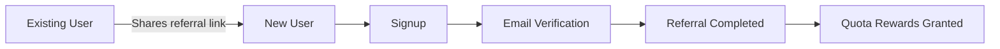
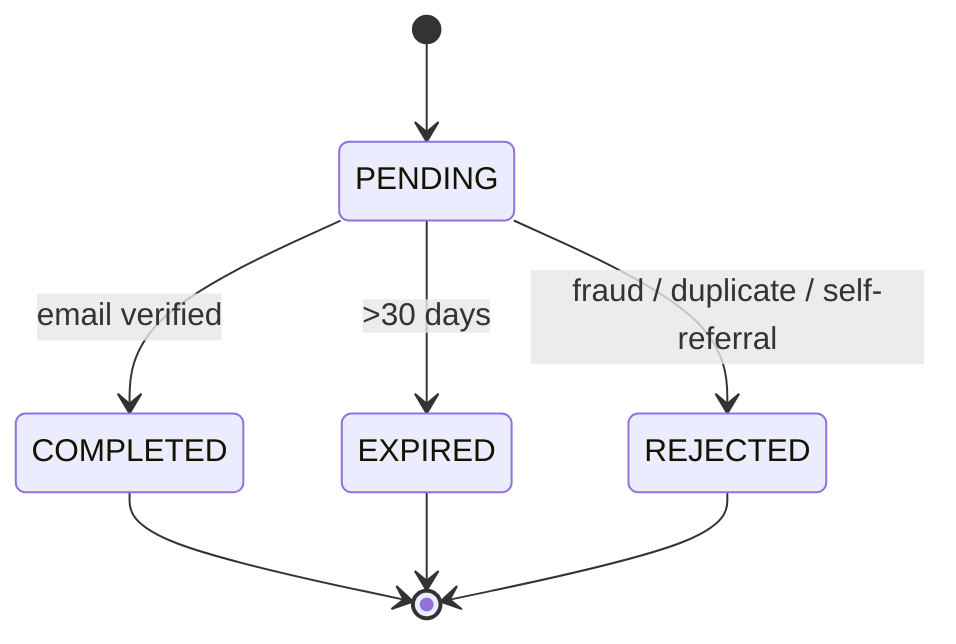
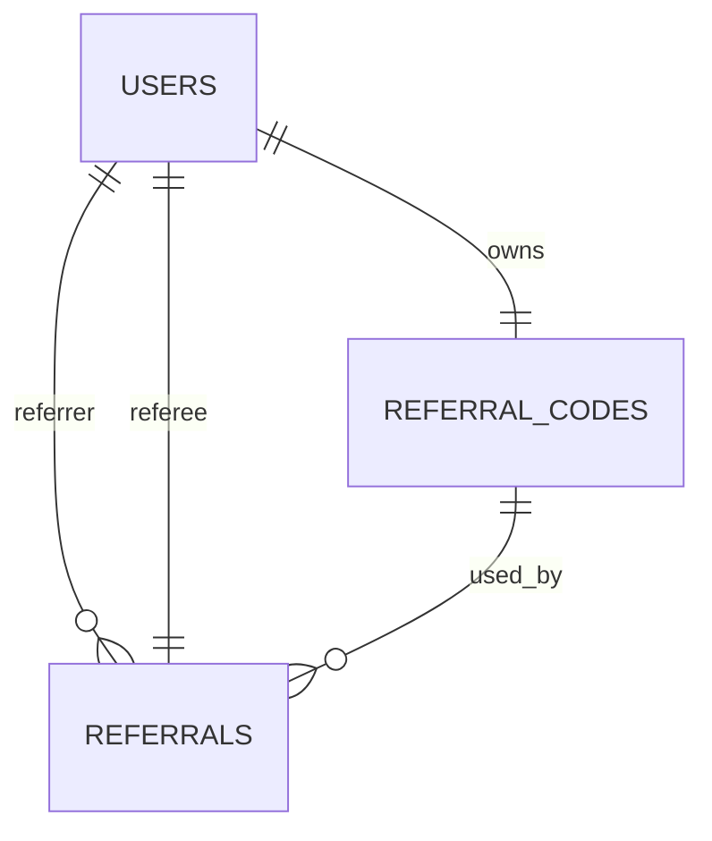
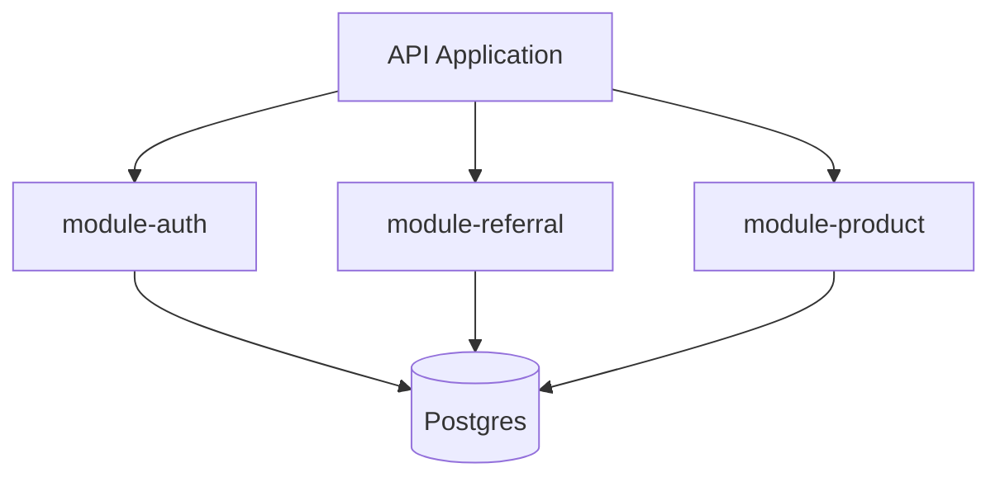
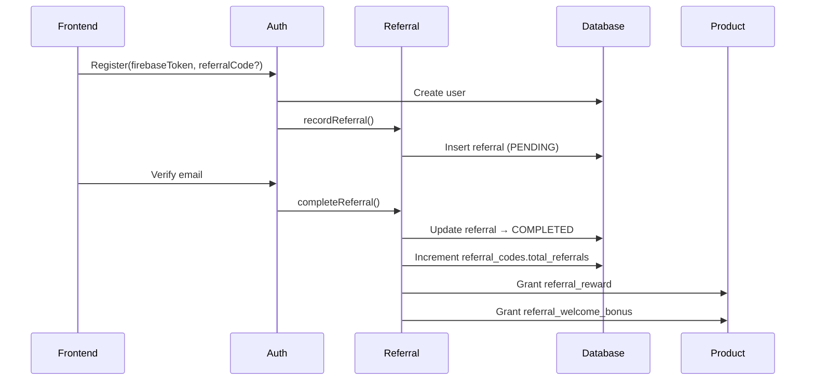
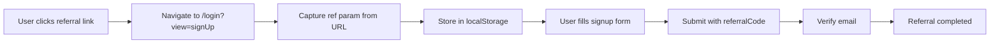
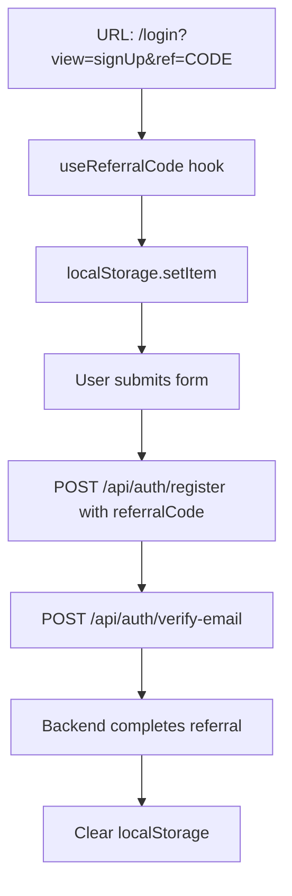
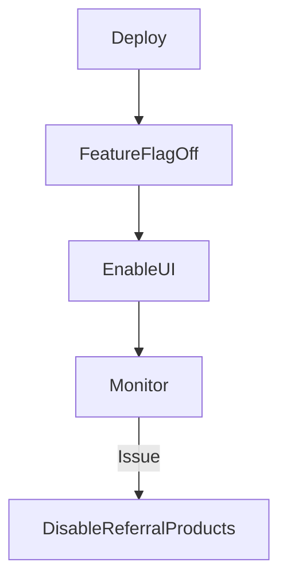

Cre: @Nguyen Dang

***

## 1. Background & Problem Statement

Public users currently lack built-in growth mechanics to drive viral adoption. User acquisition relies primarily on paid marketing and organic discovery, which are costly and do not scale efficiently.

The product already has:

* A free tier with quota limits
* A robust product/quota infrastructure
* Email verification during signup

However, there is no mechanism for existing users to invite new users and be rewarded for successful referrals.


***

## 2. Product Objective

Design and ship a **bilateral referral system** where:

* Existing users can share a unique referral link
* New users can sign up through the link
* **Both parties receive quota bonuses**
* Rewards are delivered using existing **ONE\_TIME product + quota infrastructure**

This system must:

* Drive viral adoption
* Preserve quota economics
* Never block signup
* Be safe to operate and easy to roll back

***

## 3. High-Level Product Flow



**Key product insight:**

* Rewards are tied to **email verification**, not account creation.

***

## 4. Reward Strategy (Authoritative)

### 4.1 Rewards

| Party                    | Reward                                             | Delivery                                   |
| ------------------------ | -------------------------------------------------- | ------------------------------------------ |
| Referee (new user)       | 200 credits                                        | ONE\_TIME product `referral_welcome_bonus` |
| Referrer (existing user) | 200 credits (referer can claim the share up to 5k) | ONE\_TIME product `referral_reward`        |

### 4.2 Reward Rules

1. Rewards are granted **only after email verification**
2. Rewards are granted **once per referral**
3. Rewards stack with existing subscriptions and packs
4. Rewards are never revoked automatically

### 4.3 Rationale

* \~50% of free-tier monthly allowance → meaningful but not exploitable
* No deck quota → avoids lifetime quota complexity
* Reuses existing quota logic → minimal risk

***

## 5. Referral Rules & Constraints

1. **Referral cap**: max **20 successful (COMPLETED) referrals per user (lifetime)**
2. **Qualification**: referee must complete signup **and verify email**
3. **One referrer per referee**
4. **No self-referral** (same email or Firebase UID)
5. **No duplicate reward** if referee already exists (active or soft-deleted)
6. **Referral code is permanent**, generated once per user

These rules are enforced at **database + service layer**.

***

## 6. Referral Lifecycle (State Machine)



**Only `COMPLETED` referrals grant rewards.**

***

## 7. Referral Code Format

### 7.1 Code Specification

**Format:** 8-character alphanumeric, case-sensitive

**Character set:** `[A-Z0-9]` (uppercase letters and numbers only)

* No ambiguous characters: exclude `0O1Il` to avoid user confusion
* Allowed alphabet: `23456789ABCDEFGHJKMNPQRSTUVWXYZ` (32 chars)
* Generation: SecureRandom with custom alphabet

**Properties:**

* **Collision probability:** \~1 in 1 trillion for 1M codes
* **URL-safe:** No encoding needed
* **Human-readable:** Easy to share verbally or in screenshots
* **Length:** 8 characters balances uniqueness vs UX

**Examples:**

* `A3K7M9QR`
* `B8PQRS2T`
* `XYZ34567`

### 7.2 Code Validation

**Validation rules:**

* Must be exactly 8 characters
* Must match pattern: `^[23456789ABCDEFGHJKMNPQRSTUVWXYZ]{8}$`
* Case-sensitive
* Invalid codes should NOT block signup

### 7.3 Display Format

In UI, format with visual grouping for readability:

* Store: `A3K7M9QR` (without hyphen)

***

## 8. Database Design

### 8.1 Schema Overview



### 8.2 Tables

**`referral_codes`**

Purpose: represent a user's **right to invite others**

```sql
CREATE TABLE referral_codes (
    id UUID PRIMARY KEY,
    user_id UUID NOT NULL,
    code TEXT NOT NULL,
    total_referrals INT NOT NULL DEFAULT 0,
    max_referrals INT NOT NULL DEFAULT 20,
    is_active BOOLEAN NOT NULL DEFAULT TRUE,
    created_at TIMESTAMP,
    updated_at TIMESTAMP,
    deleted_at TIMESTAMP
);
```

Constraints:

* Unique `code`
* One active code per user

**`referrals`**

Purpose: represent a **single referral attempt and outcome**

```sql
CREATE TABLE referrals (
    id UUID PRIMARY KEY,
    referrer_user_id UUID NOT NULL,
    referee_user_id UUID NOT NULL,
    referral_code_id UUID NOT NULL,
    status TEXT NOT NULL,
    referrer_product_id UUID,
    referee_product_id UUID,
    completed_at TIMESTAMP,
    created_at TIMESTAMP,
    updated_at TIMESTAMP,
    deleted_at TIMESTAMP
);
```

Constraints:

* UNIQUE(referee\_user\_id)
* Indexed by referrer\_user\_id

### 8.3 Seed Products

Two ONE\_TIME products are pre-seeded:

* `referral_reward`
* `referral_welcome_bonus`

These products define the actual quota bonuses.

***

## 9. API Specification

### 9.1 Endpoints Overview

| Method | Endpoint                 | Description                           | Auth     |
| ------ | ------------------------ | ------------------------------------- | -------- |
| GET    | `/api/referrals/code`    | Get or generate user's referral code  | Required |
| GET    | `/api/referrals/stats`   | Get referral statistics               | Required |
| GET    | `/api/referrals/history` | List referral history with pagination | Required |
| POST   | `/api/auth/register`     | Register new user (modified)          | None     |
| POST   | `/api/auth/verify-email` | Verify email (modified)               | Required |

### 9.2 Endpoint Details

**GET /api/referrals/code**

Get current user's referral code. Generates if doesn't exist.

```tsx
// Request
GET /api/referrals/code
Authorization: Bearer {token}

// Response 200
{
  "code": "A3K7M9QR",
  "url": "https://layerproof.app/login?view=signUp&ref=A3K7M9QR",
  "totalReferrals": 5,
  "maxReferrals": 20,
  "isActive": true,
  "createdAt": "2026-01-15T10:30:00Z"
}

// Response 429 (Rate Limited)
{
  "error": "rate_limit_exceeded",
  "message": "Too many requests. Try again later."
}
```

**GET /api/referrals/stats**

Get detailed referral statistics.

```tsx
// Request
GET /api/referrals/stats
Authorization: Bearer {token}

// Response 200
{
  "totalReferrals": 5,
  "completedReferrals": 3,
  "pendingReferrals": 2,
  "expiredReferrals": 0,
  "rejectedReferrals": 0,
  "maxReferrals": 20,
  "remainingSlots": 15,
  "totalRewardsEarned": {
    "outlines": 15,
    "slideImages": 60,
    "speakerNotes": 30
  }
}
```

**GET /api/referrals/history**

List referral history with pagination.

```tsx
// Request
GET /api/referrals/history?page=1&limit=20&status=COMPLETED
Authorization: Bearer {token}

// Query params
// - page: number (default: 1)
// - limit: number (default: 20, max: 100)
// - status: PENDING | COMPLETED | EXPIRED | REJECTED (optional)

// Response 200
{
  "referrals": [
    {
      "id": "uuid",
      "refereeEmail": "user@example.com",
      "status": "COMPLETED",
      "completedAt": "2026-01-20T14:30:00Z",
      "createdAt": "2026-01-20T10:00:00Z"
    },
    // ...
  ],
  "pagination": {
    "page": 1,
    "limit": 20,
    "total": 45,
    "totalPages": 3
  }
}
```

**POST /api/auth/register (Modified)**

Register new user with optional referral code.

```tsx
// Request
POST /api/auth/register
Content-Type: application/json

{
  "firebaseToken": "...",
  "email": "newuser@example.com",
  "referralCode": "A3K7M9QR" // Optional
}

// Response 201
{
  "userId": "uuid",
  "email": "newuser@example.com",
  "referralStatus": "PENDING" // if referralCode provided
}

// Response 400 (Invalid code - but signup still succeeds)
{
  "userId": "uuid",
  "email": "newuser@example.com",
  "warning": "Invalid referral code - signup completed without referral"
}
```

**POST /api/auth/verify-email (Modified)**

Verify email and trigger referral completion.

```tsx
// Request
POST /api/auth/verify-email
Authorization: Bearer {token}
Content-Type: application/json

{
  "verificationCode": "123456"
}

// Response 200
{
  "verified": true,
  "referralCompleted": true, // if user signed up with referral code
  "rewardsGranted": {
    "credits": 200
  }
}
```

### 9.3 Error Responses

**Standard error format:**

```tsx
{
  "error": "error_code",
  "message": "Human-readable message",
  "details": {} // Optional additional context
}
```

**Common error codes:**

* `invalid_referral_code` - Code format invalid or doesn't exist
* `self_referral` - User trying to use own code
* `max_referrals_reached` - Referrer hit their cap
* `rate_limit_exceeded` - Too many requests
* `duplicate_referral` - User already has a referral

***

## 10. Backend System Design (How It Is Implemented)

### 10.1 Architecture Overview



**Separation of concerns:**

* Auth → user & email verification
* Referral → referral rules & lifecycle
* Product → quota mutation

### 10.2 Referral Module Responsibilities

* Generate and manage referral codes
* Validate referral attempts
* Manage referral lifecycle
* Grant rewards via product service

Auth **never** grants rewards.

### 10.3 Signup Integration Flow



**Critical guarantee:**

* Referral failure **never blocks signup**.

***

## 11. Error Handling & Retry Logic

### 11.1 Error Categories

**1. Transient errors (retry)**

* Database connection timeout
* Redis unavailable
* External API timeout (PostHog, email verification)
* Network errors

**2. Permanent errors (don't retry)**

* Invalid referral code format
* Self-referral attempt
* Duplicate referral
* Max referrals reached

**3. Degraded mode errors (fallback)**

* PostHog unavailable → use default limit (20)
* Email service down → queue for later

### 11.2 Retry Strategy

**Exponential backoff with jitter:**

* Max retries: 3 (for most operations)
* Base delay: 1 second
* Max delay: 10 seconds
* Add random jitter to prevent thundering herd
* Don't retry permanent errors (ValidationError, DuplicateError, etc.)

### 11.3 Reward Granting Logic

**Critical operation:** Must be idempotent and retryable

**Flow:**

1. Check if rewards already granted (idempotency check)
2. Grant `referral_reward` product to referrer
3. Grant `referral_welcome_bonus` product to referee
4. Update referral record with product IDs
5. Commit transaction

**Retry settings:**

* Max retries: 5
* Base delay: 2 seconds
* Must be wrapped in database transaction

### 11.4 Email Notification Retry

**Non-critical operation:** Use background queue

* Queue: `email-notifications`
* Max attempts: 3
* Backoff: exponential, 5 seconds base delay
* Remove on complete, keep on fail for debugging
* Email failure should NOT block reward granting

### 11.5 Fallback & Degraded Mode

**PostHog unavailable:**

* Timeout: 2 seconds
* Fallback to default limit (20)
* Log warning but continue operation

**External email API unavailable:**

* Use circuit breaker pattern
* Timeout: 5 seconds
* Fallback to local email validation
* Don't block signup

### 11.6 Monitoring & Alerting

**Alert conditions:**

* Reward granting failure rate > 1%
* Email queue depth > 1000
* PostHog timeout rate > 10%
* Retry exhausted count > 10/minute

***

## 12. Frontend System Design (How It Is Implemented)

### 12.1 UI Placement

* No new route
* Referral UI lives inside existing `/billing` page

### 12.2 Frontend Module Structure

```
web/src/modules/referral/
├── services/
├── hooks/
├── components/
│   ├── ReferralSection
│   ├── ReferralCodeCard
│   ├── ReferralStatsCard
│   └── ReferralHistoryTable
└── types/
```

### 12.3 Referral Link Format

**Primary URL format (navigates to signup page):**

```
https://layerproof.app/login?view=signUp&ref={CODE}
```

**Examples:**

* [`https://layerproof.app/login?view=signUp&ref=A3K7M9QR`](https://layerproof.app/login?view=signUp\&ref=A3K7M9QR)
* [`https://layerproof.app/login?view=signUp&ref=B8PQRS2T`](https://layerproof.app/login?view=signUp\&ref=B8PQRS2T)

**Route structure:**

* Path: `/login`
* Query params:
  * `view=signUp` (required) - switches to signup view
  * `ref={CODE}` (required) - referral code

**Deep linking (mobile apps - future):**

```
layerproof://login?view=signUp&ref={CODE}
```

**Important notes:**

* Referral link **always navigates to signup view**, not homepage or login view
* New users click link → land on signup form → create account → verify email
* No need to manually enter referral code - it's captured automatically from URL
* URL structure: `/login?view=signUp&ref={CODE}` (view param switches to signup mode)

**Share message templates:**

*Email:*

```
Subject: Create presentations faster with LayerProof

I've been using LayerProof and it's amazing! Sign up with my referral link and we'll both get bonus credits:

https://layerproof.app/login?view=signUp&ref=A3K7M9QR
```

*Social media:*

```
Check out LayerProof for AI-powered presentations 🚀
Sign up with my link: https://layerproof.app/login?view=signUp&ref=A3K7M9QR
```

### 12.4 Referral Capture Flow

**User journey:**



**Technical flow:**



**Key implementation details:**

1. **Route structure**: `/login?view=signUp&ref=CODE` - single route with view switcher
2. **Automatic capture**: When user clicks referral link, the code is automatically captured and stored
3. **Transparent to user**: User doesn't see or manually enter the code - it's handled in the background
4. **Persistent**: Code stays in localStorage even if user refreshes page during signup
5. **Cleanup**: Code is cleared after successful signup to prevent reuse

Frontend does **not** validate referral logic - validation happens on backend.

***

## 13. UX Messaging & Email Notifications

### 13.1 UI Messaging States

| State                | User sees             | Message                                                                                                         |
| -------------------- | --------------------- | --------------------------------------------------------------------------------------------------------------- |
| Active (\< max)      | Referral link + stats | "Share your link and earn rewards! You've referred {X}/{max\_referrals} users."                                 |
| Reached cap          | Disabled share button | "You've reached your referral limit ({max\_referrals} successful referrals). Thank you for spreading the word!" |
| Pending verification | In history table      | "Pending - Waiting for email verification"                                                                      |
| Expired referral     | In history table      | "Expired - User didn't verify within 30 days"                                                                   |

### 13.2 Email Notifications

**Referee (new user) - Welcome email:**

```
Subject: Welcome to LayerProof! You've earned bonus credits

Hi {referee_name},

Welcome to LayerProof! Thanks to {referrer_name}, you've received:
✓ +200 credit

Start creating amazing presentations now!
```

**Referrer (existing user) - Success notification:**

```
Subject: You've earned referral rewards!

Hi {referrer_name},

Great news! {referee_name} joined LayerProof using your referral link.

You've earned:
✓ +5 outlines
✓ +20 slide images
✓ +10 speaker notes

You've successfully referred {current_count}/{max_referrals} users.
```

**Referrer - Approaching limit (optional, at 18/20):**

```
Subject: You're close to your referral limit!

You've referred {current_count}/{max_referrals} users. Only {remaining} spots left!
```

***

## 14. Infrastructure & Operations Design

### 14.1 **Referral Expiration Check**

### **Behavior**

When retrieving referral records, the system must apply a runtime filtering rule for expired referrals.

* Any referral record that satisfies the following conditions:
  * `status = PENDING`
  * `created_time` is older than **30 days** compared to the current system time

→ MUST be **excluded from the response payload**.

### **Important Notes**

* The system MUST NOT:
  * Update the referral status to `EXPIRED`
  * Modify or revoke quota associated with the referral
  * Perform any database write operations

### 14.2 Observability

**Metrics**

*Basic counters:*

* referral\_created\_total
* referral\_completed\_total
* referral\_expired\_total
* referral\_rejected\_total

*Referral funnel (for PostHog/Analytics):*

* `referral_link_clicked` - Track clicks on referral links
* `referral_signup_started` - User began signup with referral code
* `referral_signup_completed` - Account created
* `referral_email_verified` - Referral completed

*Conversion rates to track:*

* Click → Signup rate
* Signup → Verification rate
* Overall conversion: Click → Completed

**Logs**

* referral.created
* referral.completed
* referral.rejected
* referral.expired

### 14.3 Rollout & Kill Switch



Referral system can be disabled **without touching signup or auth**.

***

## 15. Dynamic Limit Configuration

### 15.1 Why Dynamic Limits?

Hard-coded limit of 20 doesn't support:

* VIP/power users who drive more growth
* Promotional campaigns (e.g., "Double your referral limit this month!")
* A/B testing different caps
* Personalized limits based on user behavior

### 15.2 Implementation Approach

**Two-tier system (CMS + PostHog):**

**1. CMS (Database) - Per-user overrides**

```sql
-- Admin can set custom limit for specific users via CMS
UPDATE referral_codes 
SET max_referrals = 50 
WHERE user_id = '...';
```

**2. PostHog - Cohort-based defaults**

* Feature flag: `referral-max-limit`
* Default value: 20
* Timeout: 2 seconds
* Fallback to default on error

### 15.3 Precedence Logic

**Priority order:**

1. **CMS per-user override** - Check `referral_codes.max_referrals` in database
2. **PostHog cohort rule** - Check feature flag `referral-max-limit`
3. **Default** - Fallback to 20

First non-default value wins.

### 15.4 Admin Requirements

**CMS user management:**

* Display: `{total_referrals}/{max_referrals}`
* Edit field: "Custom referral limit"
* Action: Update `referral_codes.max_referrals`

**PostHog feature flag: `referral-max-limit`**

* Default: `20`
* Cohort examples: `premium: 40`, `vip: 100`, `promo-feb: 30`

***

## 16. Edge Cases & Expected Behavior

| Scenario              | Behavior                     |
| --------------------- | ---------------------------- |
| Invalid referral code | Signup proceeds normally     |
| Self-referral         | Referral rejected            |
| Max referrals reached | No reward                    |
| Email not verified    | Referral expires             |
| Retry verification    | Idempotent, no double reward |

***

## 17. Acceptance Criteria

### Database

* Tables and indexes created correctly
* Unique referee enforced

### Backend

* Referral logic isolated in module-referral
* Rewards granted exactly once
* Cap enforced correctly

### Frontend

* Referral link captured
* Referral section visible
* Stats and history accurate

### Infra

* Expiration job running
* Metrics visible
* Kill switch functional

***

## 18. Definition of Done

The referral system is complete when:

* Users can invite others via referral links
* Both parties receive correct rewards after verification
* Signup is never blocked
* All edge cases behave as specified
* System is observable and rollback-safe
